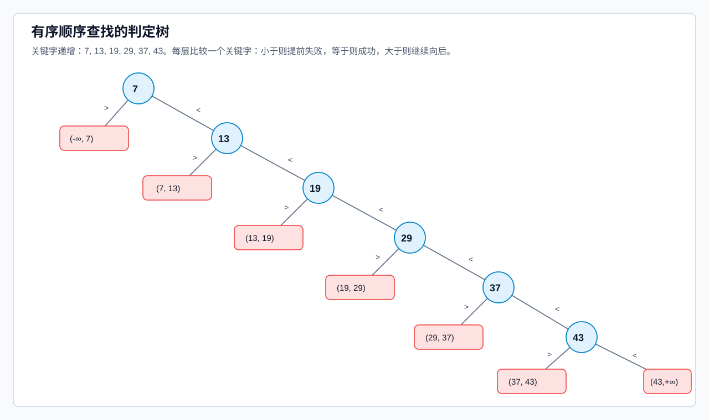
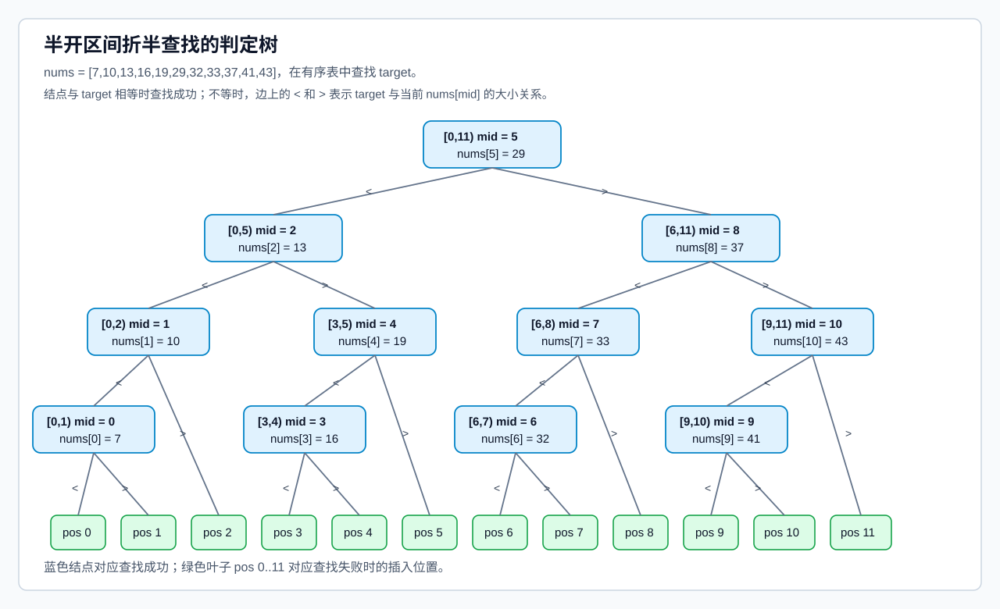

# 顺序查找

顺序查找也称线性查找，通常用于线性表。基本思想是从表的一端开始，逐个比较关键字，直到查找成功或查完整个表。

[html-card height=620](../assets/sequential-search-process.html)

## 普通顺序查找的 ASL

普通顺序查找中，若表长为 $n$：

$$
ASL_{success}=\frac{1+2+\cdots+n}{n}=\frac{n+1}{2}
$$

若查找失败，需要比较完所有 $n$ 个元素：

$$
ASL_{fail}=n
$$

若各元素被查概率不相等，顺序表不要求有序时，应把被查概率大的元素**靠近查找起点**，降低成功 ASL。

## 有序表中的顺序查找的 ASL

若线性表已经按关键字递增排列，顺序查找可以提前失败：当当前元素已经大于目标关键字时，后面的元素更大，不可能再出现目标。



有序顺序查找的成功 ASL 仍是：

$$
ASL_{success}=\frac{n+1}{2}
$$

失败查找有 $n+1$ 个失败区间。对于递增表 $a_1<a_2<\cdots<a_n$：

- $(-\infty,a_1)$：比较 $a_1$ 后失败，长度为 1。
- $(a_1,a_2)$：比较到 $a_2$ 后失败，长度为 2。
- $\cdots$
- $(a_{n-1},a_n)$：比较到 $a_n$ 后失败，长度为 $n$。
- $(a_n,+\infty)$：比较完 $n$ 个元素后失败，长度为 $n$。

从判定树角度看，这些失败区间就是：

- 在第 1 层发现 `key < a_1`。
- 在第 2 层发现 $a_1<key<a_2$。
- $\cdots$
- 在第 $n$ 层发现 $a_{n-1}<key<a_n$。
- 比较完第 $n$ 个元素后仍未命中，即 $key>a_n$。

因此：

$$
ASL_{fail}=\frac{1+2+\cdots+n+n}{n+1}
=\frac{n}{2}+\frac{n}{n+1}
$$


# 折半查找

折半查找也称二分查找，适用于有序的顺序表。即在定义域为\[lo, hi)的单增的f(x), 找出最小的ans, 使得f(ans)>0成立。单减同理，甚至可以进行预处理先转化为单增的情况。

于是问题变成：找最小的 `ans`，使 `f(ans)` 成立。也就是找第一个 `nums[ans] >= target` 的位置。

- 若 `f(mid)` 成立，`mid` 可能是答案，但左侧可能还有更小答案，所以记录 `ans = mid`，并令 `hi = mid`。
- 若 `f(mid)` 不成立，`mid` 一定不是答案，且答案只可能在右侧，所以令 `lo = mid + 1`。
- 循环结束时 `lo == hi`，搜索区间为空，返回记录到的 `ans` 或返回 `lo`。

[html-card height=1020](../assets/lower-bound-binary-search-process.html)

可见，算法的时间复杂度为$O(\log_2 n)$

> [!warning] 折半查找不一定快于顺序查找。
>
折半查找的时间复杂度是 $O(\log_2 n)$，顺序查找是 $O(n)$，这只说明折半查找在**数量级**上更优。但对某一次**具体**查找，折半查找未必比较次数更少。
>
>> [!example]
>>例如目标正好是顺序表第一个元素时，顺序查找只需要比较 1 次；折半查找要先比较中间元素，再逐步缩小到左端。
>>折半查找的优势体现在大规模、平均意义和最坏情况控制上。


## 代码实现

伪代码如下：

```plaintext
algorithm binary-search(lo,hi)
	while the search area has elments do:
		mid <- lo + (hi-lo)/2;
		if f(mid) satisfied: // the answer may occur here
            		ans := mid;
			hi <- mid; 
            // the search area could have no elments when in the next loop, so return ans; 
            // but mid>ans if next loop continues,  
            // for this is a right-open area, hi <- mid;
		else :
			lo <- mid + 1; 
            // mid is not the answer, and mid < answer;
            // for this is a left-close area, lo <- mid + 1;
	end while
	return ans;

```

### 例

1. 已知一个有序数组，查找一个元素的位置并返回。若该元素不存在，则返回元素应插入的位置。

**定义域为\[0, nums.size())，找出最小的ans, nums\[ans\] >= target成立**

```C
int searchInsert(int[] nums, int numSize, int target)
{
        int left=0,right=numSize,ans=numSize-1; // f(ans)= nums[ans] 的定义域： ans \in [left, right)
        while(left<right){
            int mid=(right-left)/2 + left;//防止直接right+left造成溢出
            if(nums[mid]>=target){//因为我们要找的就是nums[ans]>=target
                ans=mid; //所以mid可能为答案。
                right=mid; //也可能mid不是答案，更新开的上界为mid
            }
            else{
                left=mid+1; // 否则mid绝对不是答案。更新闭的下界为mid+1。
            }
        }
        return ans;
 }
```

2. 给你一个非负整数 `x` ，计算并返回 `x` 的 **算术平方根** 。
   由于返回类型是整数，结果只保留 **整数部分** ，小数部分将被 **舍去 。**

**定义域为$[0, +\infty)$, 找出最大的$\text{ans}$, $\text{ans}^2 \leqslant x$**

```C
int mySqrt(int x) {
       long long l = 0, r = x+1, ans; // ans \in [0, +\infty), 但这里对r这样赋值只是为了让ans快速收敛。
        while (l < r) {
            long long  mid = (r - l)/2 + l;
            if (mid * mid <= x) {//因为要找的就是ans*ans<=x
                ans = mid; //所以mid可能为答案。
                l = mid + 1; //也可能mid不是答案，更新闭的下界为mid+1
            } else {
                r = mid; // 否则mid绝对不是答案。更新开的上界为mid。
            }
        }
        return ans; 
    }
```

也有一些**更抽象**的二分查找：

[3350.检测相邻递增子数组II](https://leetcode.cn/problems/adjacent-increasing-subarrays-detection-ii/description/)

令f(x)：`k=x`时数组是否存在两个相邻且长度为 `k` 的严格递增子数组,存在则`f(x)=1`否则`f(x)=0`。

则`f(x)`单减。**满足二分查找的使用**

于是原问题即为

**定义域为$[2, \lceil nums.length/2 \rceil)$, 找出最大的$\text{ans}$, $f(\text{ans})>=1$**

解法示例：

```go
func f(x int, lengths []int) bool {
    count := 0
    for _, l := range lengths {
        if l >= 2*x { 
            return true
        }
        if l >= x {
            count++
            if count >= 2 {
                return true
            }
        }else{
            count = 0
        }
    }
    return false
}

func maxIncreasingSubarrays(nums []int) int {
    n := len(nums)
    lengths := []int{}
    cur := 1
    for i := 1; i < n; i++ {
        if nums[i] > nums[i-1] {
            cur++
        } else {
            lengths = append(lengths, cur)
            cur = 1
        }
    }
    lengths = append(lengths, cur)

    lo := 1; hi := len(nums)/2+1
    var ans int
    for lo<hi{
        mi := lo + (hi-lo)/2
        if f(mi,lengths){
            ans = mi
            lo = mi + 1
        }else{
            hi=mi
        }
    }
    return ans
}
```

### 何时使用二分查找？

- 寻找一个*值*
- 题目条件给出数组，以及建立在数组上的一个**单调**映射f。
- 这个*值*使得f*恰好*满足某个条件。

## 边界判定树

半开区间二分的判定树，对于非终端节点，若 $target$ 等于 $nums[mid]$ ， 则说明查找成功；若 $target$ 不等于$nums[mid]$ ，每个内部结点对应一次 `mid` 判断：
$$
nums[mid] > target\;?
$$

- `true`：`mid` 作为开的上界，转向左侧区间 `[lo, mid)`。
- `false`：`mid` 小于闭的下界，转向右侧区间 `[mid+1, hi)`。
- 叶子：查找失败的节点应插在原数组中的位置。



## 判定树的性质

将查找失败的结点也计入树。

1. **任意节点左子树与右子树高度差只可能是0或1**
2. **任意节点的左子树结点个数与右子树节点个数之差只可能是0或2**
3. **以任意节点为根形成的子树也满足上述1-2性质，即具有递归定义性。**

若原数组有$n$个元素，则对应查找失败的情况共$n+1$种，则树一共有$2n+1$个节点。

设树高$h$, 由于$2^{h-1}-1< 2n+1 \leqslant 2^{h} -1$,所以得到

$$
h=1+\lceil \log_2(n+1)\rceil
$$

所以一次查找最多会比较 $h-1$ 次，即 $\lceil \log_2(n+1)\rceil$ 次。
## 折半查找的 ASL

画出查找判定树，具体问题具体分析。

# 分块查找

分块查找也称索引顺序查找。它把查找表分成若干块，并建立索引表。索引表中通常保存每个块的最大关键字和该块的存储区间。

分块查找的结构要求是：==块间有序，块内可以无序==。也就是说，前一块中任意元素的关键字都小于后一块中任意元素的关键字，但同一块内部不要求排序。

[html-card height=680](../assets/block-search-process.html)

分块查找过程分两步：

1. 在索引表中确定目标可能属于哪一块。索引表可以顺序查找，也可以折半查找。
2. 在对应块内顺序查找。

若折半查找索引表时没有直接命中目标关键字，循环最后会出现 `low > high`。此时应进入 `low` 指向的块，而不是 `high` 指向的块。

原因是索引表保存的是各块最大关键字。折半结束时，`low` 左边的索引最大值都小于目标关键字，`high` 右边的索引最大值都大于等于目标关键字。第一个最大关键字大于等于目标的块，正是 `low` 所指的块。若 `low` 已越过索引表范围，则说明目标大于所有块的最大关键字，查找失败。

```c
typedef struct {
    int max_key;
    int start;
    int end;
} IndexBlock;

static int lower_bound_block(const IndexBlock index[], int block_count, int key) {
    int low = 0;
    int high = block_count - 1;
    int answer = block_count;

    while (low <= high) {
        int mid = low + (high - low) / 2;

        if (index[mid].max_key >= key) {
            answer = mid;
            high = mid - 1;
        } else {
            low = mid + 1;
        }
    }

    return answer;
}

int block_search(const int a[], const IndexBlock index[], int block_count, int key) {
    int block = lower_bound_block(index, block_count, key);
    if (block == block_count) {
        return -1;
    }

    for (int i = index[block].start; i <= index[block].end; ++i) {
        if (a[i] == key) {
            return i;
        }
    }

    return -1;
}
```

## 分块查找的 ASL

设长度为 $n$ 的查找表被均匀分为 $b$ 块，每块 $s$ 个元素，因此 $n=bs$。设索引查找的平均查找长度为 $L_I$，块内查找的平均查找长度为 $L_S$，则：

$$
ASL=L_I+L_S
$$

1. 若索引表采用顺序查找：

$$
L_I=\frac{1+2+\cdots+b}{b}=\frac{b+1}{2}
$$

块内采用顺序查找：

$$
L_S=\frac{1+2+\cdots+s}{s}=\frac{s+1}{2}
$$

所以：

$$
ASL=\frac{b+1}{2}+\frac{s+1}{2}
=\frac{s^2+2s+n}{2s}=\frac{1}{2}\left( s+ \frac{n}{s} \right)+1 \geqslant \sqrt{ s \cdot \frac{n}{s} } + 1
$$

当仅当 $s=\sqrt n$ 时，顺序索引的分块查找 ASL 取得最小值：

$$
ASL_{min}=\sqrt n+1
$$

2. 若索引表采用折半查找，常按树高估计：

$$
L_I=\lceil \log_2(b+1)\rceil,\qquad
L_S=\frac{s+1}{2}
$$

因此：

$$
ASL=\lceil \log_2(b+1)\rceil+\frac{s+1}{2}
$$
