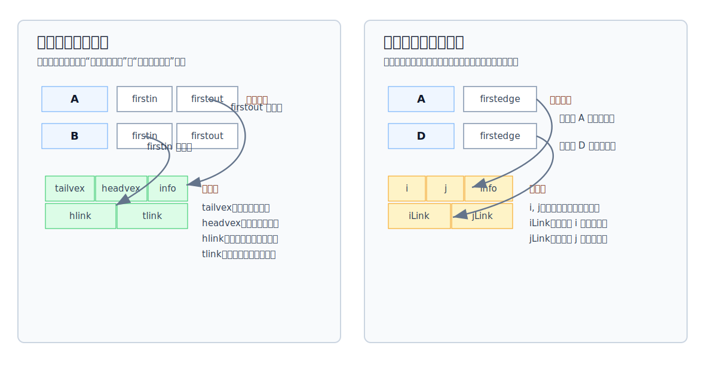

# 十字链表与邻接多重表

[[adjacency-list|邻接表]]对稀疏图很省空间，但它有两个典型不便：

- 有向图中，邻接表默认保存出边，找入边要扫描整个邻接表。
- 无向图中，每条边会在两个顶点的链表里存两份，删除边或删除顶点时要处理冗余边结点。

十字链表和邻接多重表就是针对这两个问题设计的。

其思想皆为：链头数组表示顶点，链接的每一个不同的节点都表示**不同**的边。



## 十字链表

十字链表用于存储**有向图**。

它的核心规则是：一个**弧**结点同时出现在两条链中：

- 弧尾顶点的出边链。
- 弧头顶点的入边链。

顶点结点包含：

| 字段 | 含义 |
|---|---|
| `data` | 顶点数据 |
| `firstin` | 以该顶点为弧头的第一条弧，即第一条入边 |
| `firstout` | 以该顶点为弧尾的第一条弧，即第一条出边 |

弧结点包含：

| 字段 | 含义 |
|---|---|
| `tailvex` | 弧尾顶点编号 |
| `headvex` | 弧头顶点编号 |
| `info` | 权值或其他弧信息 |
| `hlink` | 弧头相同的下一条弧 |
| `tlink` | 弧尾相同的下一条弧 |


```c
typedef struct OLArcNode {
    int tailvex;                 // 弧尾下标：弧从哪个顶点发出
    int headvex;                 // 弧头下标：弧指向哪个顶点
    int weight;                  // 弧上的权值；无权图可统一记为 1
    struct OLArcNode *hlink;     // 下一条弧头相同的弧，用来沿入边链前进
    struct OLArcNode *tlink;     // 下一条弧尾相同的弧，用来沿出边链前进
} OLArcNode;

typedef struct {
    char data;                   // 顶点数据
    OLArcNode *firstin;          // 第一条入边
    OLArcNode *firstout;         // 第一条出边
} OLVertexNode;
```

> [!tip] 查找方向
> 要找顶点 $v$ 的所有出边，顺着 `firstout` 和 `tlink` 走；要找顶点 $v$ 的所有入边，顺着 `firstin` 和 `hlink` 走。

十字链表的空间复杂度为：

$$
O(|V|+|E|)
$$

它的表示方式不唯一，因为同一条入边链或出边链中的弧结点顺序可以不同。

## 邻接多重表

邻接多重表用于存储**无向图**。

它的核心规则是：每条无向边只存一个边结点，但这个边结点同时挂在两个端点的边链中。

顶点结点包含：

| 字段 | 含义 |
|---|---|
| `data` | 顶点数据 |
| `firstedge` | 与该顶点相连的第一条边 |

边结点包含：

| 字段 | 含义 |
|---|---|
| `i` | 边依附的一个顶点编号 |
| `j` | 边依附的另一个顶点编号 |
| `info` | 权值或其他边信息 |
| `iLink` | 依附于顶点 `i` 的下一条边 |
| `jLink` | 依附于顶点 `j` 的下一条边 |

```c
typedef struct AMEdgeNode {
    int i;                       // 边的一个端点
    int j;                       // 边的另一个端点
    int weight;                  // 边上的权值；无权图可统一记为 1
    struct AMEdgeNode *iLink;    // 继续访问依附于 i 的下一条边
    struct AMEdgeNode *jLink;    // 继续访问依附于 j 的下一条边
} AMEdgeNode;

typedef struct {
    char data;                   // 顶点数据
    AMEdgeNode *firstedge;       // 与该顶点相连的第一条边
} AMVertexNode;
```

> [!tip] 沿顶点找边
> 从顶点 $v$ 的 `firstedge` 出发后，每经过一个边结点，都要判断当前顶点是该边的 `i` 端还是 `j` 端：若当前顶点是 `i`，下一步走 `iLink`；若当前顶点是 `j`，下一步走 `jLink`。

邻接多重表的空间复杂度为：

$$
O(|V|+|E|)
$$

它适合无向图，尤其适合需要频繁删除边或删除顶点的场景，因为每条边只有一个边结点，不会像无向图邻接表那样保存两份冗余信息。

## 快速对比

| 存储结构 | 适用对象 | 解决的问题 | 空间复杂度 | 注意点 |
|---|---|---|---|---|
| 十字链表 | 有向图 | 出边和入边都能沿链直接找 | $O(\lvert V\rvert+\lvert E\rvert)$ | 只能用于有向图 |
| 邻接多重表 | 无向图 | 每条边只存一份，删除边或顶点较方便 | $O(\lvert V\rvert+\lvert E\rvert)$ | 只能用于无向图 |
