# 队列的定义与基本操作

## 定义

队列是只允许在一端插入、在另一端删除的 [[linear-list-definition-and-operations|线性表]]。

- 允许删除的一端称为队头。
- 允许插入的一端称为队尾。
- 没有元素的队列称为空队列。

队列的核心性质是先进先出：先进入队列的元素先离开队列，简称 FIFO。

## 基本操作

- `InitQueue(&Q)`：初始化队列。
- `DestroyQueue(&Q)`：销毁队列。
- `EnQueue(&Q, x)`：入队。若队列未满，将 `x` 加入，使其成为新的队尾。
- `DeQueue(&Q, &x)`：出队。若队列非空，删除队头元素，并用 `x` 返回。
- `GetHead(Q, &x)`：读队头元素，但不删除。
- `QueueEmpty(Q)`：判断队列是否为空。

## 队列与栈的区别

栈 的插入和删除发生在同一端，后进先出。队列的插入和删除发生在两端，先进先出。

做题时不要只看“受限线性表”这个共同点，要看插入端和删除端是否相同。

## 常见实现

队列可以用顺序存储或链式存储实现。顺序队列如果直接用数组并不断移动队头，会浪费前端空间；实际考查重点通常是 [[circular-queue|循环队列]]。链式存储实现见 [[linked-queue|链队列]]。
