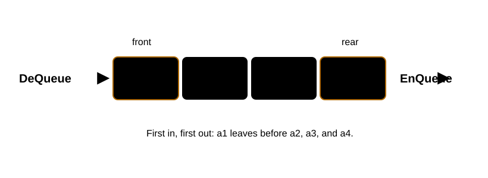

# 定义

队列是只允许在一端插入、在另一端删除的 [[Linear-List-Definition-And-Operations|线性表]]。

- 允许删除的一端称为队头。
- 允许插入的一端称为队尾。
- 没有元素的队列称为空队列。

与栈不同，栈的插入和删除发生在同一端，后进先出。队列的核心性质是先进先出：先进入队列的元素先离开队列，简称 FIFO。

# 基本操作

- `InitQueue(&Q)`：初始化队列。
- `DestroyQueue(&Q)`：销毁队列。
- `EnQueue(&Q, x)`：入队。若队列未满，将 `x` 加入，使其成为新的队尾。
- `DeQueue(&Q, &x)`：出队。若队列非空，删除队头元素，并用 `x` 返回。
- `GetHead(Q, &x)`：读队头元素，但不删除。
- `QueueEmpty(Q)`：判断队列是否为空。

# 常见实现

队列可以用顺序存储或链式存储实现。

顺序队列实际通常是 [[Circular-Queue|循环队列]]。

链式存储实现见 [[Linked-Queue|链队列]]。
