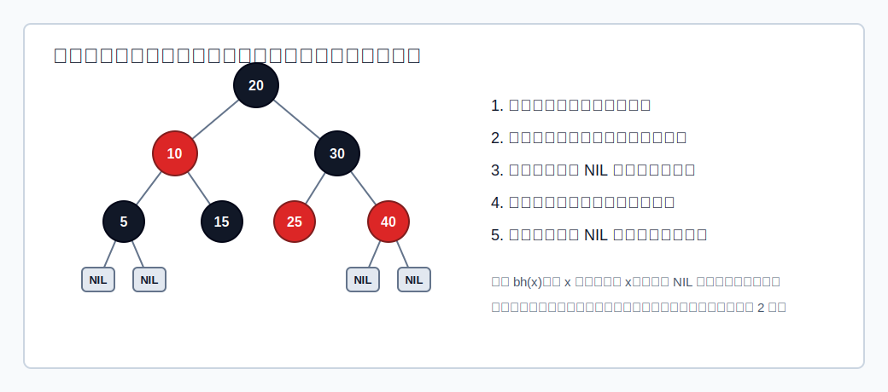

# 定义

**红黑树**是一种自平衡的二叉排序树。它比 [[avl-tree|AVL 树]] 的平衡条件更宽松，但仍能保证树高为 $O(\log_2 n)$。

红黑树必须同时满足：

1. 它是一棵二叉排序树。
2. 每个结点要么是红色，要么是黑色。
3. 根结点是黑色。
4. 叶结点是黑色。这里的叶结点通常指外部空结点，也就是 `NULL`、失败结点或 NIL 结点。
5. 不存在两个相邻的红结点，即红结点的父结点和孩子结点都必须是黑色。
6. 对任一结点，从该结点到任一叶结点的简单路径上，黑结点数相同。

可以把判断口诀记为：

>[!important]
> **左根右，根叶黑，不红红，黑路同。**

判断一棵树是不是红黑树时，应按以下顺序查：

1. 先看是否满足 BST 的左小右大关系。
2. 再看根是否为黑，外部空叶是否按黑结点处理。
3. 检查是否存在红父红子。
4. 对每个结点检查到各 NIL 叶结点的黑结点数是否相同。

## 黑高

结点 `x` 的**黑高** `bh(x)` 定义为：

> 从 `x` 出发，不含 `x` 本身，到达任一 NIL 叶结点的路径上黑结点总数。

因为红黑树要求“黑路同”，所以对同一个结点 `x`，无论走向哪个 NIL 叶结点，黑高都相同。

**黑高常用于推导红黑树的高度上界。**

* 若根结点黑高为 $h$，内部结点数最少的情况是：只保留黑结点形成的满二叉树。此时至少有$2^h - 1$个内部结点。

* 若根结点黑高为 $h$，内部结点数最多的情况是：在黑结点之间尽量插入红结点，形成高度约为 $2h$ 的满树形态。此时至多有 $2^{2h} - 1$个内部结点。

## 高度性质

红黑树有两个重要高度性质。

###  1. 最长路径不超过最短路径的 2 倍

从某结点到 NIL 叶结点的所有路径，黑结点数相同。又因为红结点不能连续出现，所以最长路径最多是在每两个黑结点之间插入一个红结点。

因此：

$$
\text{最长路径} \le 2 \times \text{最短路径}
$$

这个性质是红黑树“近似平衡”的核心。

###  2. 含 n 个内部结点的红黑树高度上界

若红黑树总高度为 $H$，由于最长路径不超过黑结点路径的两倍，根的黑高至少约为 $H/2$。

又因为黑高为 $bh$ 的红黑树至少有 $2^{bh}-1$ 个内部结点，所以：

$$
n \ge 2^{H/2}-1
$$

推出：

$$
H \le 2\log_2(n+1)
$$

重点是结论：

$$
H = O(\log_2 n)
$$

因此红黑树查找时间复杂度为：

$$
Search = O(\log_2 n)
$$

# 查找

红黑树查找与 [[binary-search-tree#查找|BST]] 一致：

- `key` 小于当前结点，向左子树走。
- `key` 大于当前结点，向右子树走。
- 相等则查找成功。
- 走到 NIL 叶结点则查找失败。

颜色不参与查找方向判断。颜色只用于维持树高。

# 插入

红黑树插入先按 BST 插入位置：

1. 先查找，确定插入位置。
2. 若新结点是根结点，染为黑色。
3. 若新结点不是根结点，先染为红色。
4. 若插入后仍满足红黑树定义，结束。
5. 若出现连续红结点，根据叔叔结点颜色调整。

>[!question] 
>为什么新结点默认染红？
>- 若染黑，会让某些路径黑结点数增加，容易破坏“黑路同”。
>- 染红不会改变路径黑结点数，只可能破坏“不红红”。
>- “不红红”可以通过局部旋转和染色修复。

[html-card height=1220](../assets/red-black-insert.html)

## 叔叔为红

若新结点 `N` 的父结点 `P` 是红色，叔叔结点 `U` 也是红色：

1. `P` 染黑。
2. `U` 染黑。
3. 祖父结点 `G` 染红。
4. 把 `G` 当作新的 `N`，继续向上检查。
5. 若 `G` 最后成为根，根再染黑。

这类情况不旋转，只染色并把问题上推。

## 叔叔为黑

### LL 或 RR

若父结点红、叔叔黑，并且新结点与父结点在同一侧：

- LL：`N` 是 `G` 左孩子 `P` 的左孩子。
- RR：`N` 是 `G` 右孩子 `P` 的右孩子。

处理：

- LL：以 `G` 为根右单旋。
- RR：以 `G` 为根左单旋。
- 旋转后，原父结点 `P` 上升替代祖父。
- `P` 染黑，`G` 染红。

可以记为：

> 黑叔 LL/RR：父换爷，单旋加染色。

### LR 或 RL

若父结点红、叔叔黑，并且新结点与父结点不在同一侧：

- LR：`N` 是 `G` 左孩子 `P` 的右孩子。
- RL：`N` 是 `G` 右孩子 `P` 的左孩子。

处理：

- LR：`N` 一步上升替代祖父；`N->left = P`，`N->right = G`。`N` 原来的左、右子树分别挂到 `P` 的右边、`G` 的左边。
- RL：`N` 一步上升替代祖父；`N->left = G`，`N->right = P`。`N` 原来的左、右子树分别挂到 `G` 的右边、`P` 的左边。
- `N` 染黑，`G` 染红。

可以记为：

> 黑叔 LR/RL：儿换爷，一步重连加染色。

这与“双旋”描述等价：LR 等价于先对 `P` 左旋、再对 `G` 右旋；RL 等价于先对 `P` 右旋、再对 `G` 左旋。手绘时直接按 `N` 的中序位置重连更快。

> [!question]
> 插入调整是否会继续向上
红黑树插入后是否继续调整，取决于遇到的是**红叔**还是**黑叔**：
> - **黑叔**：旋转加染色后，局部根变为黑色，连续红被消除，黑高也恢复一致；这次插入调整通常到此结束。
> - **红叔**：只染色，不旋转；父、叔变黑，祖父变红。此时祖父要当作新的插入结点继续向上检查，因为它可能和自己的红父亲形成新的连续红。
> - 若上推到根，最后把根染黑。
> 所以红黑树插入不像 AVL 那样统一说“调整一次就一定结束”。更准确地说：**黑叔旋转后结束；红叔染色可能继续向上。**

# 删除

红黑树删除时间复杂度仍为：

$$
Delete = O(\log_2 n)
$$

# 与 AVL 树对比

| 项目 | AVL 树 | 红黑树 |
|---|---|---|
| 平衡要求 | 严格，高度差不超过 `1` | 较宽松，用颜色约束黑高 |
| 查找性能 | 很稳定 | 同为 $O(\log_2 n)$，但常数可能略大 |
| 插入删除 | 更容易触发旋转 | 调整通常较少 |
| 适用倾向 | 查找多、修改少 | 插入删除频繁 |

AVL 树追求更严格的高度平衡；红黑树牺牲一点查找路径长度，换取插入删除时更少的结构调整。
