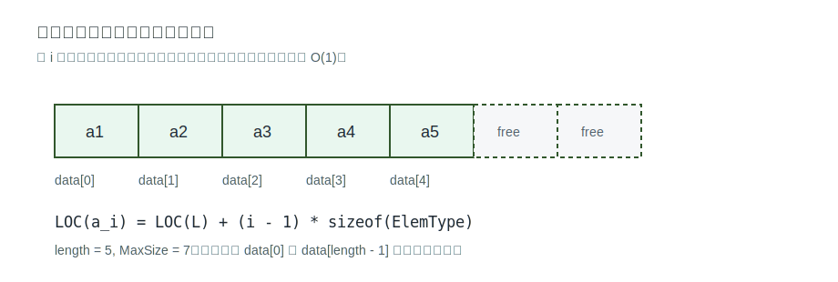

# 顺序表的存储与实现



## 定义

顺序表是用顺序存储方式实现的 [[linear-list-definition-and-operations|线性表]]。它把逻辑上相邻的数据元素存放在物理位置也相邻的存储单元中。

若第一个元素地址为 `LOC(L)`，每个元素占 `sizeof(ElemType)` 字节，则第 `i` 个元素的地址为：

`LOC(a_i) = LOC(L) + (i - 1) * sizeof(ElemType)`

因此顺序表可通过地址公式直接定位元素。

## 静态分配

典型结构：

```c
#define MaxSize 10
typedef struct {
    ElemType data[MaxSize];
    int length;
} SqList;
```

特点：

- `data` 是固定长度数组。
- `length` 记录当前表长。
- 存储空间大小在定义后固定，容量不可变。
- 若数组未初始化，未使用区域可能有脏数据；合法访问应依据 `length`，不应把未使用位置当作有效元素。

一个最小初始化函数：

```c
void InitList(SqList *L) {
    L->length = 0;
}
```

不必把 `data` 中所有位置都清零，因为 `length` 决定哪些位置是有效元素。若题目要求默认值，或后续代码会读取未使用区域，才需要额外初始化数组。

## 动态分配

典型结构：

```c
#define InitSize 10
typedef struct {
    ElemType *data;
    int MaxSize;
    int length;
} SeqList;
```

关键点：

- `data` 指向动态申请的一整片连续空间。
- `MaxSize` 记录当前最大容量。
- `length` 记录当前表长。
- C 语言中常用 `malloc` 申请空间，用 `free` 释放空间；二者应成对出现。
- 动态分配可以扩容，但扩容通常需要重新申请更大连续空间并移动原有元素，时间代价较高。

初始化与销毁：

```c
bool InitList(SeqList *L) {
    L->data = (ElemType *)malloc(sizeof(ElemType) * InitSize);
    if (L->data == NULL) return false;
    L->MaxSize = InitSize;
    L->length = 0;
    return true;
}

void DestroyList(SeqList *L) {
    free(L->data);
    L->data = NULL;
    L->MaxSize = 0;
    L->length = 0;
}
```

动态顺序表仍然必须保持一整片连续空间。它的“动态”只是容量可通过重新申请空间改变，不是像链表那样每个结点分散申请。

## 顺序表特点

- 支持随机访问，可在 `O(1)` 时间找到第 `i` 个元素。
- 存储密度高，每个结点只存储数据元素，不额外存储指针。
- 扩容不方便，尤其需要连续存储空间。
- 插入、删除不方便，常需要移动大量元素。

## 关联

顺序表的具体操作见 [[sequential-list-insert-delete|顺序表的插入与删除]]、[[sequential-list-search|顺序表的查找]]。与链表的整体比较见 [[sequential-list-vs-linked-list|顺序表与链表对比]]。
