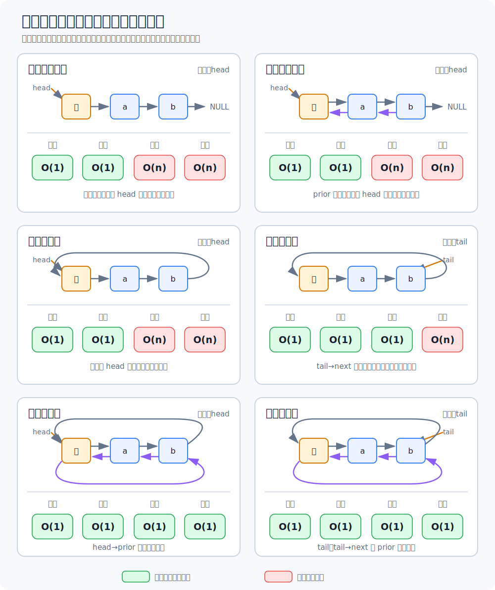

# 顺序表与链表对比

## 共同点

顺序表和链表都用于实现 [[linear-list-definition-and-operations|线性表]]，逻辑结构都是线性结构。区别主要来自存储结构不同。

## 链表的六种组织方式

链表还要区分单链与双链、循环与非循环。非循环链表默认只保留头指针；循环链表既可以保留头指针，也可以保留尾指针，因此共有六种常见组织方式。下面均按**带头结点**讨论，表头操作指在第一个数据结点处插入或删除。

### 头尾插删的性能

| 链表形态 | 头插 | 头删 | 尾插 | 尾删 |
| --- | ---: | ---: | ---: | ---: |
| 非循环单链表，头指针 | `O(1)` | `O(1)` | `O(n)` | `O(n)` |
| 非循环双链表，头指针 | `O(1)` | `O(1)` | `O(n)` | `O(n)` |
| 循环单链表，头指针 | `O(1)` | `O(1)` | `O(n)` | `O(n)` |
| 循环单链表，尾指针 | `O(1)` | `O(1)` | `O(1)` | `O(n)` |
| 循环双链表，头指针 | `O(1)` | `O(1)` | `O(1)` | `O(1)` |
| 循环双链表，尾指针 | `O(1)` | `O(1)` | `O(1)` | `O(1)` |

表中的复杂度包含定位结点和修改指针。双链表虽能通过 `prior` 直接找到已知结点的前驱，但非循环双链表只有头指针时，仍要从表头遍历才能找到表尾。循环双链表则不同：头结点的 `prior` 指向表尾，从头指针也能在 `O(1)` 时间到达两端。

循环单链表保留尾指针时，`tail->next` 指向头结点，因此头插、头删和尾插都不需要遍历；尾删仍需寻找尾结点的前驱。若应用频繁在两端操作，尾指针循环单链表或循环双链表比普通头指针单链表更合适。

## 存储结构对比

| 项目 | 顺序表 | 链表 |
|---|---|---|
| 存储方式 | 顺序存储 | 链式存储 |
| 空间要求 | 需要连续空间 | 可使用离散空间 |
| 存储密度 | 高，只存数据元素 | 低，需要额外指针域 |
| 容量变化 | 不方便，扩容代价高 | 较方便，按需申请结点 |
| 随机存取 | 支持 | 不支持 |

## 初始化与销毁

顺序表初始化通常需要预分配一大片连续空间。静态分配容量不可变；动态分配容量可变，但扩容仍可能需要移动大量元素。

链表初始化只需建立头指针或头结点，之后按需申请结点。销毁链表时需要依次释放各结点。

## 插入与删除

顺序表插入、删除时，主要时间开销来自移动元素，平均时间复杂度为 `O(n)`。

链表修改指针本身是 `O(1)`，一次完整操作是否需要 `O(n)`，取决于当前保留的入口指针能否直接到达目标结点或其前驱。对于中间的第 `i` 个位置，通常仍要先遍历；对于表头和表尾，则按上表判断。

## 查找

- 顺序表按位查找：`O(1)`。
- 链表按位查找：`O(n)`。
- 顺序表和链表按值查找：通常都是 `O(n)`。
- 若顺序表有序，可使用二分查找达到 `O(log_2 n)`。

## 如何选择

优先选链表：表长难以预估，频繁插入、删除，且不要求高效随机访问。若操作集中在表头和表尾，还要继续选择合适的链表形态，而不能只写“采用链表”。

优先选顺序表：表长可预估，查询操作较多，尤其是按位访问较多，或需要较高存储密度。链表的存储密度低，因为每个结点除了数据域还要保存指针域。

## 开放题答题框架

先说明二者逻辑结构相同，都是线性表；再说明存储结构不同：顺序表采用顺序存储，链表采用链式存储；随后从空间分配、随机访问、插入删除、查找效率、容量变化几个角度比较；最后结合题目场景给出选择。

## 关联

细节可回看 [[sequential-list-storage|顺序表的存储与实现]]、[[singly-linked-list-definition|单链表的定义与头结点]]、[[circular-linked-list|循环链表]]、[[doubly-linked-list|双链表]]、[[static-linked-list|静态链表]]。
