# 共享栈

## 核心思想

共享栈让两个 [[sequential-stack|顺序栈]] 共享同一个数组。一个栈从数组低地址端向高地址端增长，另一个栈从高地址端向低地址端增长。



```c
#define MaxSize 100

typedef struct {
    ElemType data[MaxSize];
    int top0;
    int top1;
} SharedStack;
```

初始化：

```c
void InitSharedStack(SharedStack *stack) {
    stack->top0 = -1;
    stack->top1 = MaxSize;
}
```

## 判满条件

两个栈顶相邻时，数组中没有空位：

```c
stack->top0 + 1 == stack->top1
```

若省略结构体访问写法，判满条件也可记为 `top0 + 1 == top1`。

这是共享栈最重要的条件。

## 进栈

```c
bool Push0(SharedStack *stack, ElemType value) {
    if (stack->top0 + 1 == stack->top1) return false;
    stack->top0++;
    stack->data[stack->top0] = value;
    return true;
}

bool Push1(SharedStack *stack, ElemType value) {
    if (stack->top0 + 1 == stack->top1) return false;
    stack->top1--;
    stack->data[stack->top1] = value;
    return true;
}
```

## 出栈

```c
bool Pop0(SharedStack *stack, ElemType *value) {
    if (stack->top0 == -1) return false;
    *value = stack->data[stack->top0];
    stack->top0--;
    return true;
}

bool Pop1(SharedStack *stack, ElemType *value) {
    if (stack->top1 == MaxSize) return false;
    *value = stack->data[stack->top1];
    stack->top1++;
    return true;
}
```

## 适用场景

共享栈适合两个栈的空间需求此消彼长、总容量有上限的场景。它不能突破数组总容量，只是减少“一边空着、另一边已满”的浪费。
