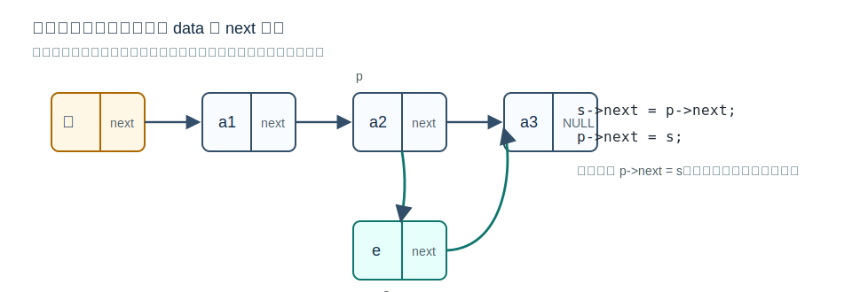

# 单链表的定义与头结点



## 定义

单链表是用链式存储方式实现的 [[linear-list-definition-and-operations|线性表]]。每个结点通常包含数据域和指针域：

```c
typedef struct LNode {
    ElemType data;
    struct LNode *next;
} LNode, *LinkList;
```

- `data` 存放数据元素。
- `next` 存放后继结点地址。
- `LinkList` 强调这是一个单链表。
- `LNode *` 强调这是一个结点指针。

## 不带头结点

头指针 `L` 直接指向第一个数据结点。空表时 `L == NULL`。

缺点：对第一个结点的插入、删除需要特殊处理，代码边界情况较多。

## 带头结点

头指针 `L` 指向头结点，头结点不存储有效数据，只用于统一操作。空表时 `L->next == NULL`。

优点：

- 第一个数据结点之前也有一个“前驱”，便于统一插入、删除逻辑。
- 空表和非空表的很多操作形式一致。
- 考试代码题中常见，需注意题目是否说明带头结点。

初始化带头结点单链表：

```c
bool InitList(LinkList *L) {
    *L = (LNode *)malloc(sizeof(LNode));
    if (*L == NULL) return false;
    (*L)->next = NULL;
    return true;
}
```

这里传入 `LinkList *L`，是因为初始化需要修改头指针本身，让它指向新申请的头结点。

## 易错点

- 头结点不是第一个数据元素。
- 头指针是指向链表第一个结点的指针；带头结点时，它指向头结点。
- 单链表不能随机存取，访问第 `i` 个元素必须从头开始沿 `next` 遍历。

## 关联

操作实现见 [[singly-linked-list-insert-delete|单链表的插入与删除]]、[[singly-linked-list-search-and-build|单链表的查找与建立]]。
