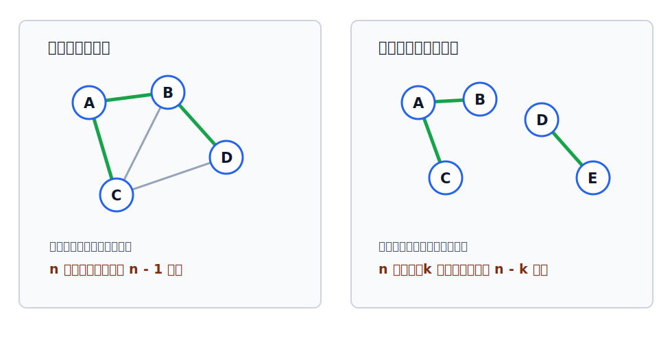

# 生成树与生成森林

生成树讨论的是：在保持全部顶点连通的前提下，把边删到尽可能少。非连通图不能得到覆盖全图的一棵生成树，只能得到生成森林。

相关基础：[[graph-subgraph|子图与生成子图]]、[[graph-connectivity-and-components|连通性与连通分量]]。

## 生成树

连通图的生成树是包含图中全部顶点的一个**极小连通子图**。

若图中有 $n$ 个顶点，则任意生成树都有：

$$
n-1
$$

条边。

生成树有两个等价的直观判断：

| 角度 | 说明 |
|---|---|
| 边尽可能少 | 去掉生成树中任意一条边，图都会变成非连通 |
| 无环 | 在生成树中加入原图里一条额外边，一定会形成回路 |

> [!tip] 极小与极大
> 连通分量是“极大连通子图”：连通区域已经不能再扩大。生成树是“极小连通子图”：已经连通，但边已经少到不能再删。

## 生成森林

非连通无向图没有覆盖全图的生成树。此时，对每个[[graph-connectivity-and-components|连通分量]]分别取一棵生成树，这些生成树合在一起称为**生成森林**。

若非连通图有 $n$ 个顶点、$k$ 个连通分量，则其生成森林共有：

$$
n-k
$$

条边。因为每个连通分量若有 $n_i$ 个顶点，其生成树有 $n_i-1$ 条边，总和为：

$$
\sum_{i=1}^{k}(n_i-1)=n-k
$$

