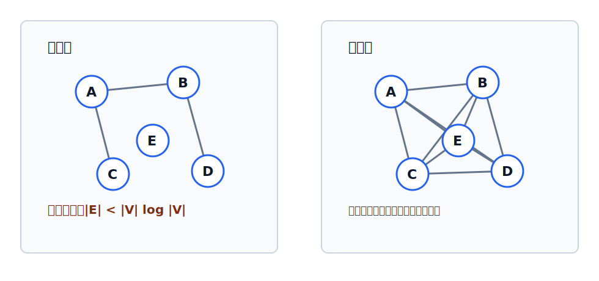

# 稀疏图与稠密图

稀疏图和稠密图描述的是图中边的多少。它们没有绝对分界线，通常用于选择存储结构或算法。

## 稀疏图

边数很少的图称为**稀疏图**。

一般可用下面的经验界限：

$$
|E|<|V|\log |V|
$$

当图满足这个条件时，可以将 $G$ 视为稀疏图。

## 稠密图

边数很多的图称为**稠密图**。

稠密图通常接近[[complete-graph|完全图]]的边数上界：

- 无向图最多有 $C_n^2=\frac{n(n-1)}{2}$ 条边；
- 有向图最多有 $2C_n^2=n(n-1)$ 条弧。

## 查阅重点

| 维度 | 稀疏图 | 稠密图 |
|---|---|---|
| 边数 | 少 | 多 |
| 常见存储 | 邻接表更节省空间 | 邻接矩阵可直接判断相邻 |
| 算法选择 | 常按边集或邻接表扫描 | 可接受矩阵级别扫描 |
| 判断边界 | 没有绝对界限 | 没有绝对界限 |

> [!tip] 考点表述
> “一般来说 $|E|<|V|\log|V|$ 时可视为稀疏图”是经验判断，不是数学定义中的硬边界。
