# 栈的定义与基本操作

## 定义

栈是只允许在一端进行插入和删除操作的 [[linear-list-definition-and-operations|线性表]]。允许操作的一端称为栈顶，另一端称为栈底。没有元素的栈称为空栈。

栈的核心性质是后进先出：后进入栈的元素先出栈，简称 LIFO。

## 基本操作

- `InitStack(&S)`：初始化栈，构造空栈。
- `DestroyStack(&S)`：销毁栈，释放占用空间。
- `Push(&S, x)`：进栈。若栈未满，将 `x` 加入并成为新栈顶。
- `Pop(&S, &x)`：出栈。若栈非空，删除栈顶元素，并用 `x` 返回。
- `GetTop(S, &x)`：读栈顶。若栈非空，用 `x` 返回栈顶元素，但不删除。
- `StackEmpty(S)`：判断栈是否为空。

## 栈顶访问

栈的使用场景中通常只关心栈顶元素，不能直接访问栈底或中间元素。若题目允许任意位置访问，那就不是普通栈的操作模型。

`Pop` 和 `GetTop` 的区别很常考：

- `Pop` 会删除栈顶元素。
- `GetTop` 只读取栈顶元素，栈的内容不变。

## 出栈序列

给定进栈顺序后，不是所有排列都能成为合法出栈序列。判断一个具体序列是否合法时，按目标出栈序列从左到右模拟：

1. 若栈顶正好是当前目标元素，则出栈。
2. 若栈顶不是目标元素，就继续按给定进栈顺序进栈。
3. 若所有元素都已进栈，栈顶仍不是目标元素，则该序列不合法。

合法出栈序列的个数见 [[stack-output-sequences-and-catalan-number|出栈序列与卡特兰数]]。

## 常见实现

栈可以用 [[sequential-stack|顺序栈]] 或 [[linked-stack|链栈]] 实现。顺序栈空间固定，适合容量上限明确的场景；链栈按需申请结点，更适合规模难以预估的场景。
