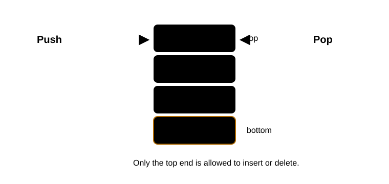

# 定义

栈是只允许在一端进行插入和删除操作的 [[Linear-List-Definition-And-Operations|线性表]]。允许操作的一端称为栈顶，另一端称为栈底。没有元素的栈称为空栈。

栈的核心性质是后进先出：后进入栈的元素先出栈，简称 LIFO。

# 栈的语义

若将栈里的元素视为待解决的问题，则入栈表示问题产生，出栈表示问题解决，后产生的问题先得到解决。

这也是 [[Monotonic-Stack|“单调栈”模型问题为什么是使用栈]] 和 [[Recursion|递归为什么可以用栈表示]] 的原因。

# 基本操作

栈只关心栈顶元素，不能直接操作栈底或中间元素。

- `InitStack(&S)`：初始化栈，构造空栈。
- `DestroyStack(&S)`：销毁栈，释放占用空间。
- `Push(&S, x)`：进栈。若栈未满，将 `x` 加入并成为新栈顶。
- `Pop(&S, &x)`：出栈。**会删除栈顶元素。** 若栈非空，删除栈顶元素，并用 `x` 返回。
- `GetTop(S, &x)`：读栈顶。**只读取栈顶元素，栈的内容不变。** 若栈非空，用 `x` 返回栈顶元素，但不删除。
- `StackEmpty(S)`：判断栈是否为空。

# 出栈序列

给定进栈顺序后，不是所有排列都能成为合法出栈序列。判断一个具体序列是否合法时，按目标出栈序列从左到右模拟：

1. 若栈顶正好是当前目标元素，则出栈。
2. 若栈顶不是目标元素，就继续按给定进栈顺序进栈。
3. 若所有元素都已进栈，栈顶仍不是目标元素，则该序列不合法。

合法出栈序列的个数见 [[Output-Sequences]]。

# 常见实现

栈可以用 [[Sequential-Stack|顺序栈]] 或 [[Linked-Stack|链栈]] 实现。顺序栈空间固定，适合容量上限明确的场景；链栈按需申请结点，更适合规模难以预估的场景。
