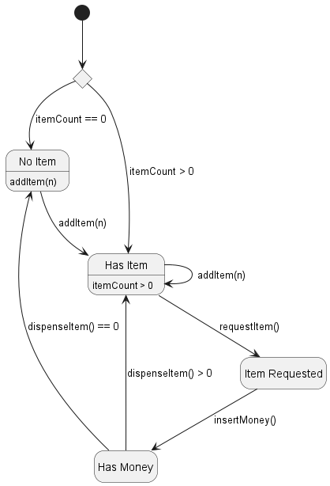
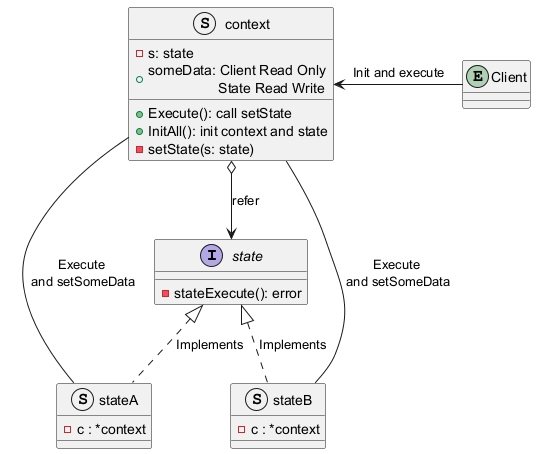

# 1. 什么是状态模式

状态模式（State Pattern）是一种行为型设计模式，它允许对象在其内部状态改变时改变其行为。状态模式将对象的状态封装成独立的类，使客户端可以透明地切换对象的状态。


为了方便理解，这里引入有限状态机（Finite State Machine）的概念。

## 1.1 有限状态机

有限状态机（Finite State Machine，FSM）是一个数学模型，它包含一组有限的状态、一组输入事件、一个初始状态以及一个状态转移函数。FSM 在任何给定时间点都处于其中一个状态。当接收到输入事件时，它会根据状态转移函数转换到新的状态。

状态模式可以看作是 FSM 的一种面向对象实现。

# 2. 为什么需要状态模式

当一个对象的行为取决于它的状态，并且它必须在运行时根据状态改变行为时，可以使用状态模式。状态模式可以将与特定状态相关的行为局部化，并且使得状态转换显式化。

# 3. 状态模式的实现（go）

让我们以一个自动售货机为例。售货机有以下几种状态：

*   `hasItem`: 有商品状态
*   `noItem`: 无商品状态
*   `itemRequested`: 商品请求状态
*   `hasMoney`: 已投币状态

状态转移如下：

*   `hasItem` -> `itemRequested`：`requestItem()`
*   `itemRequested` -> `hasMoney`：`insertMoney()`
*   `hasMoney` -> `hasItem`：`dispenseItem()>0`
*   `hasMoney` -> `noItem`：`dispenseItem()==0` 
*   `NoItem` -> `hasItem`：`addItem(n)`
*   `HasItem` -> `HasItem`：`addItem(n)`

```go
package vending

import "fmt"

// 状态接口：定义状态的行为
type state interface {
	requestItem() error
	insertMoney() error
	dispenseItem() int
	addItem(n int) int
}

// 上下文：持有当前状态引用
type context struct {
	s *state
    count int
}

func NewContext(itemCount int) *context {
	var s state
	if itemCount > 0 {
		s = &hasItemState{}
	} else {
		s = &noItemState{}
	}
    c := &context{s: s, count: itemCount}
    initAllStates(c)
	return c
}

var (
	hasItem       *hasItemState
	noItem        *noItemState 
	itemRequested *itemRequestedState
	hasMoney      *hasMoneyState
)

// initAllStates 初始化所有状态
func initAllStates(c *context) {
	hasItem       = &hasItemState{c: c}
	noItem        = &noItemState{c: c}
	itemRequested = &itemRequestedState{c: c}
	hasMoney      = &hasMoneyState{c: c}
}

func (c *context) RequestItem() error  { return c.s.requestItem(c) }
func (c *context) InsertMoney() error  { return c.s.insertMoney(c) }
func (c *context) DispenseItem() error { 
    if c.s.dispenseItem() == 0 {
        return fmt.Errorf("can't dispense")
    }
    return nil
}
func (c *context) AddItem(n int) error     { 
    if c.s.addItem(n) == 0 {
        return fmt.Errorf("can't add item")
    }
    return nil
} 

// 状态切换
func (c *context) setState(s *state) { c.s = s }

//展示数量（非必须）
func (c *context) ShowCount() int { return c.count }


// NoItem：无货
type noItemState struct{c *context}

func (st *noItemState) requestItem() error  { return fmt.Errorf("no item") }
func (st *noItemState) insertMoney() error  { return fmt.Errorf("no item") }
func (st *noItemState) dispenseItem() int { return 0 }
func (st *noItemState) addItem(n int) int {
	st.c.count += n
	c.setState(hasItem)
	return st.c.count
}

// HasItem：有货
type hasItemState struct{c *context}

func (st *hasItemState) requestItem() error {
	c.setState(itemRequested)
	return nil
}
func (st *hasItemState) insertMoney() error  { return fmt.Errorf("request first") }
func (st *hasItemState) dispenseItem() int { return 0 }
func (st *hasItemState) addItem(n int) int      { st.c.count+=n; return st.c.count } // 自环

// ItemRequested：已请求
type itemRequestedState struct{c *context}

func (st *itemRequestedState) requestItem() error  { return fmt.Errorf("already requested") }
func (st *itemRequestedState) insertMoney() error {
	c.setState(hasMoney)
	return nil
}
func (st *itemRequestedState) dispenseItem() int { return fmt.Errorf("insert first") }
func (st *itemRequestedState) addItem(n int) int      { st.c.count+=n; return st.c.count } // 自环

// HasMoney：已投币
type hasMoneyState struct{c *context}

func (st *hasMoneyState) requestItem() error { return fmt.Errorf("already requested") }
func (st *hasMoneyState) insertMoney() error { return fmt.Errorf("already has money") }
func (st *hasMoneyState) dispenseItem() int {
	st.c.count--
	if st.c.count > 0 {
		c.setState(hasItem)
	} else {
		c.setState(noItem)
	}
	return st.c.count
}
func (st *hasMoneyState) addItem(n int) int  { 
    return 0
} 
```

客户端

```go
package main

import (
	"fmt"
	"log"

	"vending"
)

func main() {
	c := vending.NewContext(10) // 初始状态：hasItem
    fmt.Println("count:", c.ShowCount())
	err := c.RequestItem() // 状态切换：hasItem -> itemRequested
	if err != nil {
		log.Fatal(err)
	}
	err = c.InsertMoney() // 状态切换：itemRequested -> hasMoney
	if err != nil {
		log.Fatal(err)
	}
	err = c.DispenseItem() // 状态切换：hasMoney -> hasItem
	if err != nil {
		log.Fatal(err)
	}
    fmt.Println("count:", c.ShowCount())
    err = c.AddItem(5) // hasItem -> hasItem
    if err != nil {
        log.Fatal(err)
    }
    fmt.Println("count:", c.ShowCount())
}
```

输出：

```
count: 10
count: 9
count: 14
```

FSM 图如下：



类图


