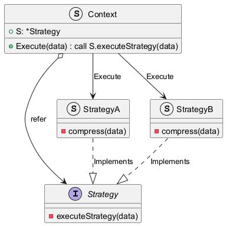

# 1. 什么是策略模式？

策略模式（Strategy Pattern）是一种行为设计模式，它定义了一系列算法，并将每个算法封装起来，使它们可以相互替换。策略模式让算法的变化独立于使用算法的客户端。

核心思想是：当一个任务有多种处理方式（策略）时，将这些方式抽象成一个共同的接口，并为每种方式提供一个具体的实现类。环境（Context）角色持有一个策略接口的引用，从而能在运行时动态地切换和使用不同的策略。

与状态模式不同，策略模式的各种策略是独立的，客户端需要知道所有的策略，才能选择合适的策略。而状态模式的各种状态是相关的，客户端只需要知道当前状态，就可以根据状态转换规则自动切换到下一个状态。

# 2. 为什么需要策略模式？

在软件开发中，我们经常会遇到需要根据不同条件选择不同行为的场景。最直接的方法是使用 `if-else` 或 `switch-case` 结构。但当分支逻辑变得复杂，或者需要频繁增删新的分支时，这种方式会导致代码臃肿、难以维护，并且违反了“开闭原则”（对扩展开放，对修改关闭）。

策略模式正是为了解决这个问题而生。它有以下优点：

*   **简化条件逻辑**：将复杂的 `if-else` 链条替换为独立的策略类，使代码更清晰。
*   **高扩展性**：增加一个新的策略只需添加一个新的实现类，无需修改现有代码，符合开闭原则。
*   **算法重用**：策略可以被多个上下文共享。
*   **运行时动态切换**：可以在程序运行时根据需要更换算法策略。


# 3. 策略模式的实现（go）

让我们以一个数据压缩服务为例。该服务需要支持多种压缩算法，如 `zip` 和 `gzip`。

```go
package compression

// Strategy 接口定义了压缩算法
// 首先定义一个策略接口，它包含所有策略都必须实现的 `compress` 方法。
type Strategy interface {
	compress(data []byte) ([]byte, error)
}

// 为 `zip` 和 `gzip` 创建具体的策略实现。
// zipStrategy 实现了 zip 压缩
type zipStrategy struct{}

func (z *zipStrategy) compress(data []byte) ([]byte, error) {
	// 模拟 zip 压缩
	fmt.Println("Compressing data using ZIP")
	return append([]byte("zip_"), data...), nil
}

// gzipStrategy 实现了 gzip 压缩
type gzipStrategy struct{}

func (g *gzipStrategy) compress(data []byte) ([]byte, error) {
	// 模拟 gzip 压缩
	fmt.Println("Compressing data using GZIP")
	return append([]byte("gzip_"), data...), nil
}

// 创建上下文（Context）
// 上下文持有对策略接口的引用，并提供一个方法来执行策略。它还允许在运行时更换策略。

// Compressor 是上下文，它使用一个策略来压缩数据
type Compressor struct {
	S *Strategy
}

// SetStrategy 允许在运行时更换策略
func (c *Compressor) SetStrategy(strategy Strategy) {
	c.S = &strategy
}

// CompressData 执行压缩
func (c *Compressor) CompressData(data []byte) ([]byte, error) {
	return c.S.compress(data)
}
```

客户端可以根据需要创建和切换策略。

```go
package main

import (
	"fmt"
	"log"
	"compression"
)

func main() {
	data := []byte("This is some data to be compressed.")

	// 初始使用 zip 策略
	zip := &compression.zipStrategy{}
	compressor := &compression.Compressor{
		S: zip,
	}                       

	compressedData, err := compressor.CompressData(data)
	if err != nil {
		log.Fatal(err)
	}
	fmt.Printf("Compressed data: %s", compressedData)

	// 在运行时切换到 gzip 策略
	gzip := &compression.gzipStrategy{}
	compressor.SetStrategy(gzip)

	compressedData, err = compressor.CompressData(data)
	if err != nil {
		log.Fatal(err)
	}
	fmt.Printf("Compressed data: %s", compressedData)
}
```

类图：


