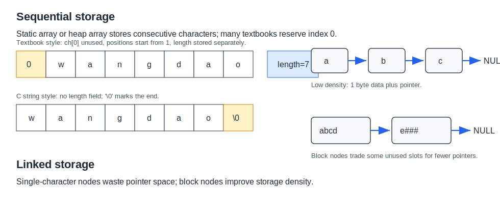

# 串的存储结构



## 顺序存储

串的顺序存储用一段连续空间保存字符，可分为静态数组实现和动态数组实现。

```c
#define MAXLEN 255

typedef struct {
    char ch[MAXLEN + 1];  // ch[0] 可不用，使位序和下标一致
    int length;
} SString;
```

教材常用 `ch[0]` 废弃不用，使第 1 个字符放在 `ch[1]`，这样“位序”和“数组下标”一致，便于表达 `SubString`、`Index` 等算法。

常见顺序存储方案：

| 方案 | 做法 | 特点 |
|---|---|---|
| `ch[0]` 存长度 | 第 0 个单元保存长度 | 长度受一个字符单元能表示的范围限制 |
| `ch[0]` 废弃，另设 `length` | 第 1 个单元保存第 1 个字符 | 教材常用，位序和下标一致 |
| 以 `'\0'` 结尾 | C 风格字符串 | 不直接保存长度，求长需扫描 |
| 堆分配存储 | 动态申请连续空间 | 更灵活，用完需要释放 |

堆分配形式：

```c
typedef struct {
    char *ch;
    int length;
} HString;
```

## 链式存储

串也可以链式存储，每个结点保存一个或多个字符。

单字符结点的问题是存储密度低：每个字符通常只占 1B，但每个指针可能占 4B 或 8B。为了提高密度，可让一个结点保存多个字符；最后一个结点未用满的位置可用特殊字符补齐。

```c
#define CHUNK_SIZE 4

typedef struct Chunk {
    char ch[CHUNK_SIZE];
    struct Chunk *next;
} Chunk;

typedef struct {
    Chunk *head;
    Chunk *tail;
    int length;
} LString;
```

链式存储适合频繁插入、删除且串较长的情形，但随机访问和模式匹配不如顺序存储直接。考研中串的模式匹配通常默认顺序存储。

## 基本操作实现要点

### 求子串

`SubString(&Sub, S, pos, len)` 的合法条件：

$$
1 \le pos \le S.length,\quad 0 \le len \le S.length - pos + 1
$$

```c
bool SubString(SString *sub, SString s, int pos, int len) {
    if (pos < 1 || pos > s.length || len < 0 || pos + len - 1 > s.length) {
        return false;
    }
    for (int k = 1; k <= len; ++k) {
        sub->ch[k] = s.ch[pos + k - 1];
    }
    sub->length = len;
    return true;
}
```

### 串比较

```c
int StrCompare(SString s, SString t) {
    int limit = s.length < t.length ? s.length : t.length;
    for (int i = 1; i <= limit; ++i) {
        if (s.ch[i] != t.ch[i]) {
            return s.ch[i] - t.ch[i];
        }
    }
    return s.length - t.length;
}
```

### 定位

`Index(S, T)` 是模式匹配问题：在主串 `S` 中找到模式串 `T` 第一次出现的位置。朴素算法见[[naive-pattern-matching]]，KMP 见[[kmp-boundary-next]]。
