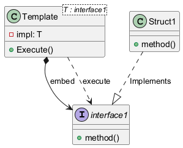

# 1. 什么是模板方法模式？

模板方法模式（Template Method Pattern）是一种行为设计模式，它在一个方法中定义一个算法的骨架，而将一些步骤的实现延迟到子类中。模板方法使得子类可以不改变一个算法的结构即可重定义该算法的某些特定步骤。核心便是利用了**多态性**，父类定义了算法的骨架，子类实现具体的步骤。

在 Go 语言中，由于没有经典的类继承，模板方法模式通常通过**接口和结构体嵌入**来模拟。

# 2. 为什么需要模板方法模式？

当你发现多个类有相似的算法，但只在某些细节上有所不同时，模板方法模式就非常有用。

*   **代码复用**：将所有子类中通用的算法逻辑提取到唯一的父类中，避免代码重复。
*   **框架控制**：它定义了一个框架，让子类在不改变框架结构的前提下，填充特定的业务逻辑。这在开发框架或库时非常常见。
*   **遵循开闭原则**：你可以在不修改模板方法的情况下，引入新的子类来扩展功能。

# 3. 模板方法模式的实现（go）

以一个通用的“资源下载器”为例。无论从 HTTP 还是 FTP 下载，其核心流程是固定的：`初始化 -> 下载数据 -> 保存文件 -> 清理`。其中，具体如何下载数据是可变的。

```go
package downloader

import "fmt"

type Steps interface {
	fetch(uri string) ([]byte, error)
	finish()
}

type Downloader[T Steps] struct {
	impl T
}

// Download 是模板方法，定义了下载资源的流程
func (d *Downloader[T]) Download(uri string) {
	fmt.Println("Preparing to download...")
	data, err := d.impl.fetch(uri)
	if err != nil {
		fmt.Printf("Download failed: %v\n", err)
		return
	}
	d.save(data)
	d.impl.finish()
}

func (d *Downloader[T]) save(data []byte) {
	fmt.Printf("Saving data (size: %d bytes) to a file.\n", len(data))
}

type HttpDownloader struct{}

func (h HttpDownloader) fetch(uri string) ([]byte, error) {
	fmt.Printf("Downloading from HTTP URI: %s\n", uri)
	return []byte("http data"), nil
}

func (h HttpDownloader) finish() {
	fmt.Println("HTTP download finished.")
}
```

客户端通过 `Downloader` 接口与具体的下载器进行交互，调用模板方法即可。

```go
package main

import "downloader"

func main() {
	httpDownloader := downloader.Downloader[downloader.HttpDownloader]{}
	httpDownloader.Download("http://example.com/file.zip")
}
```

类图


