# 时间复杂度

## 为什么不用运行时间直接评价算法

事后统计运行时间会受机器性能、编程语言、编译器质量、运行环境等因素影响，并且有些场景无法先运行再统计。因此通常事前估计算法时间开销 `T(n)` 与问题规模 `n` 的增长关系。

## 渐进时间复杂度

时间复杂度通常用大 O 表示，只关心当 `n` 足够大时增长最快的部分。

常见化简规则：

- 只保留最高阶项：`3n + 3 = O(n)`，`n^2 + 3n + 1000 = O(n^2)`。
- 忽略常数系数：`9999n = O(n)`。
- 加法规则：`O(f(n)) + O(g(n)) = O(max(f(n), g(n)))`。
- 乘法规则：`O(f(n)) * O(g(n)) = O(f(n)g(n))`。

常见阶数从低到高：

`O(1) < O(log_2 n) < O(n) < O(n log_2 n) < O(n^2) < O(n^3) < O(2^n) < O(n!) < O(n^n)`

下图使用 Python 计算各复杂度的代表函数。由于指数、阶乘和 $n^n$ 增长过快，纵轴采用 $\log_{10}$ 刻度，并把低阶函数与爆炸式增长函数分成两个区间：

图中可以直接看出：

- `O(log n)` 随 $n$ 增大得很慢，`O(n)` 和 `O(n log n)` 在较大规模下仍相对可控；
- 多项式次数每增加一级，增长差距都会随 $n$ 放大；
- `O(2^n)`、`O(n!)` 和 `O(n^n)` 即使在很小的 $n$ 下也会迅速超过多项式函数。

> [!note] 曲线比较的是增长趋势
> 大 O 忽略常数和低阶项，因此图中的代表函数不等于程序的真实运行时间。小规模输入下，常数较大的低阶算法可能暂时比常数较小的高阶算法慢；当 $n$ 足够大时，增长阶才逐渐主导差距。

## 分析代码的常用方法

- 顺序执行的代码通常只影响常数项，可忽略。
- 重点找基本操作，即执行次数随问题规模增长的核心语句。
- 多层嵌套循环通常关注最深层循环总共执行多少次。
- 若循环变量每次乘 2 或除 2，常出现 `O(log_2 n)`。
- 若双重循环都与 `n` 相关，常出现 `O(n^2)`，但仍要根据循环边界具体判断。

## 最好、最坏、平均时间复杂度

- 最好时间复杂度：最好输入情况下的时间复杂度。
- 最坏时间复杂度：最坏输入情况下的时间复杂度。
- 平均时间复杂度：所有输入等概率出现时，算法运行时间的期望。

考试中若未特别说明，很多题默认关注最坏时间复杂度，因为它给出了性能上界。

## 关联

空间消耗的渐进分析见 [[space-complexity|空间复杂度]]。具体数据结构操作的复杂度应结合操作本身的关键成本判断，例如移动元素、遍历定位、递归深度或辅助数组规模。
