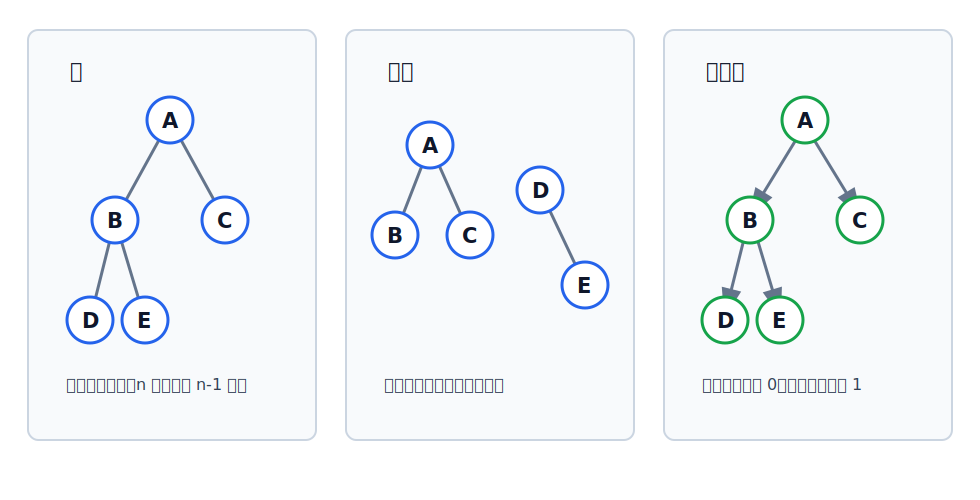

# 图中的树、森林与有向树

这里讨论的是图论视角下的树：它是无向图或有向图的一种特殊形态。树作为数据结构的完整定义、结点关系、层次、高度、度等概念见 [[tree-basic-concepts|树的基本概念]]。

## 无向图中的树

在图论中，**不存在回路且连通的无向图**称为树。

它同时满足两个条件：

- 连通：任意两个顶点之间都有路径；
- 无回路：图中不存在环。

若树有 $n$ 个顶点，则必有$n-1$条边。

这个结论和[[spanning-tree|生成树]]一致：生成树本身就是覆盖原连通图全部顶点的一棵树。

## 森林

若无向图由若干棵互不相交的树组成，则称为森林。

从连通性角度看，森林的每个连通分量都是一棵树。若森林有 $n$ 个顶点、$k$ 个连通分量，则共有$n-k$条边。

## 有向树

一个顶点的入度为 $0$，其余顶点的入度均为 $1$ 的有向图，称为**有向树**。

这个定义抓住的是“唯一入口关系”：

- 入度为 $0$ 的顶点相当于根；
- 其余顶点各有唯一前驱；
- 边有方向，方向通常体现从根向外的支配或层级关系。

## 常见考点

对 $n$ 个顶点的无向图：

- 若它是一棵树，则边数为 $n-1$。
- 若 $|E|>n-1$，则图中一定有回路。

> [!warning] 使用条件
> “$|E|>n-1$ 则一定有回路”用于 $n$ 个顶点的无向图。若只知道 $|E|=n-1$，不能直接推出它一定是树，还要看是否连通。
