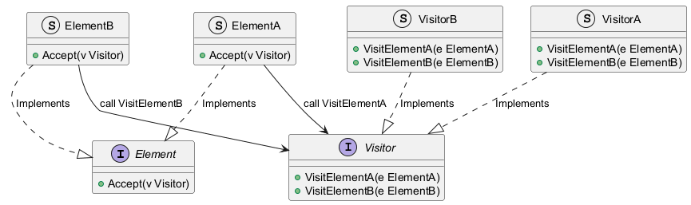

# 1. 什么是访问者模式

访问者模式（Visitor Pattern）是一种行为型设计模式，它允许你在不改变对象结构（类）的情况下，定义作用于这些对象的新操作。

核心思想是将**数据结构**与**数据操作**分离。

通常情况下，对象的方法（操作）是定义在对象内部的。但在访问者模式中，我们将操作逻辑提取出来，封装在一个独立的“访问者”对象中。当我们需要对一组对象执行操作时，我们让这些对象“接受”访问者，然后访问者会根据对象的具体类型执行相应的逻辑。

# 2. 为什么需要访问者模式

在软件开发中，我们经常面临这样的困境：
我们有一个稳定的对象结构（例如一个包含不同类型节点的语法树，或者一个包含不同几何形状的绘图系统），但我们需要经常在这个结构上定义新的操作（例如语法检查、代码生成、计算面积、导出 XML 等）。

传统的做法往往会导致问题。首先，如果在节点或形状类中堆砌各种业务逻辑（如绘图、导出、计算），就会严重违背**单一职责原则**，让类变得臃肿不堪。其次，每当我们需要新增一种操作时，就不得不去修改所有的类，这无疑打破了**开闭原则**。最后，相关的业务逻辑被分散在各个角落，难以集中管理和维护。

**访问者模式巧妙地化解了这些矛盾**。它实现了**关注点分离**，让具体的形状类只专注于管理自身的数据结构，而将复杂的业务逻辑交由访问者处理。这样一来，扩展性得到了极大的提升——当我们需要新增功能（比如“导出 JSON”）时，只需添加一个新的访问者类即可，无需改动现有的任何代码。

因此，访问者模式非常适合那些**对象结构相对稳定，但操作逻辑经常变化**的场景，特别是当你需要对一组对象执行多种互不相关的操作时。

不过需要注意的是，它也有短板：如果你需要频繁增加新的元素类型（比如新增一个 `Triangle` 形状），就需要修改 Visitor 接口及所有实现类，这反而违背了开闭原则。所以，选用此模式前，请确保你的对象结构是足够稳定的。

# 3. 访问者模式的实现（go）

假设我们有一个几何形状库，包含 `Circle`（圆形）和 `Rectangle`（矩形）。我们希望对这些形状执行两种不同的操作：
1.  **AreaCalculator**：计算面积。
2.  **JsonExporter**：导出形状的 JSON 描述。

```go
// 1. 定义元素接口 (Element)

// Shape 接口代表“元素”，它定义了一个 Accept 方法，
// 用于接收访问者。
type Shape interface {
	Accept(v Visitor)
}

// 2. 定义具体元素 (Concrete Element)

// Circle 圆形
type Circle struct {
	Radius float64
}

// Accept 实现 Shape 接口
// 关键点：利用 Go 的类型系统，将自己(c)传给访问者的 VisitCircle 方法
// 这就是“双重分派”的第一步
func (c *Circle) Accept(v Visitor) {
	v.VisitCircle(c)
}

// Rectangle 矩形
type Rectangle struct {
	Width, Height float64
}

// Accept 实现 Shape 接口
func (r *Rectangle) Accept(v Visitor) {
	v.VisitRectangle(r)
}

// 3. 定义访问者接口 (Visitor)

// Visitor 接口定义了对每种具体元素的操作方法
type Visitor interface {
	VisitCircle(c *Circle)
	VisitRectangle(r *Rectangle)
}

// 4. 定义具体访问者 (Concrete Visitor)

// --- 访问者 1: 面积计算器 ---

type AreaCalculator struct {
	area float64
}

func (a *AreaCalculator) VisitCircle(c *Circle) {
	fmt.Println("AreaCalculator: Calculating area for Circle")
	a.area += math.Pi * c.Radius * c.Radius
}

func (a *AreaCalculator) VisitRectangle(r *Rectangle) {
	fmt.Println("AreaCalculator: Calculating area for Rectangle")
	a.area += r.Width * r.Height
}

// --- 访问者 2: JSON 导出器 ---

type JsonExporter struct{}

func (j *JsonExporter) VisitCircle(c *Circle) {
	fmt.Printf("JSON: { \"type\": \"circle\", \"radius\": %.2f }\n", c.Radius)
}

func (j *JsonExporter) VisitRectangle(r *Rectangle) {
	fmt.Printf("JSON: { \"type\": \"rectangle\", \"width\": %.2f, \"height\": %.2f }\n", r.Width, r.Height)
}
```

客户端代码

```go
func main() {
	// 创建一组形状（对象结构）
	shapes := []Shape{
		&Circle{Radius: 5},
		&Rectangle{Width: 4, Height: 6},
		&Circle{Radius: 2},
	}

	// 场景 1: 使用“面积计算”访问者
	fmt.Println("--- Calculating Area ---")
	areaCalc := &AreaCalculator{}
	for _, s := range shapes {
		s.Accept(areaCalc)
	}
	fmt.Printf("Total Area: %.2f\n", areaCalc.area)

	fmt.Println("\n--- Exporting JSON ---")
	// 场景 2: 使用“JSON 导出”访问者
	jsonExp := &JsonExporter{}
	for _, s := range shapes {
		s.Accept(jsonExp)
	}
}
```

如果我们现在想增加一个“计算周长”功能，只需要创建一个新的 `PerimeterCalculator` 结构体并实现 `Visitor` 接口即可。`Circle` 和 `Rectangle` 的代码完全不需要动。这就是**开闭原则**的体现。

类图


