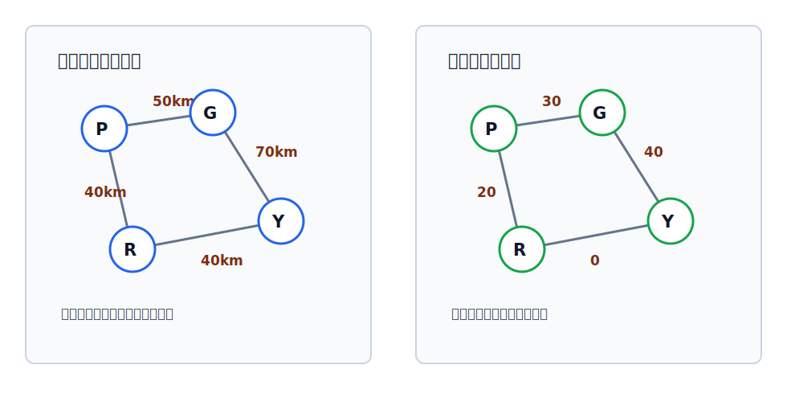

# 边的权、带权图与带权路径长度

在图中，边或弧不仅可以表示“有没有关系”，还可以标上一个数值来表示关系的强弱、代价或收益。

## 边的权

在一个图中，每条边都可以标上具有某种含义的数值，这个数值称为该边的**权值**。

权值不是固定语义，题目会给定它代表什么。解题时先读清“权值表示什么”，再判断要最短、最小、最大还是最优。

## 带权图，也称网

边上带有权值的图称为**带权图**，也称**网**。

无向图可以带权，有向图也可以带权：

- 无向带权图：边 $(u,v)$ 有权值。
- 有向带权图：弧 $\langle u,v\rangle$ 有权值，方向仍然有效。

## 带权路径长度

当图是带权图时，一条路径上所有边或弧的权值之和，称为该路径的**带权路径长度**。

> [!example]
> 例如路径 $P\to G\to R\to Y$
> 若三条边的权值分别是 $50,40,40$，则这条路径的带权路径长度为：
> $$
 50+40+40=130
 $$